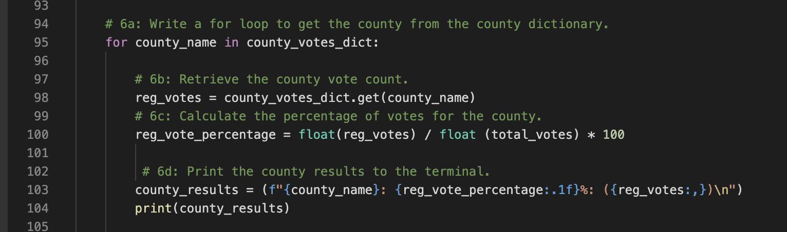
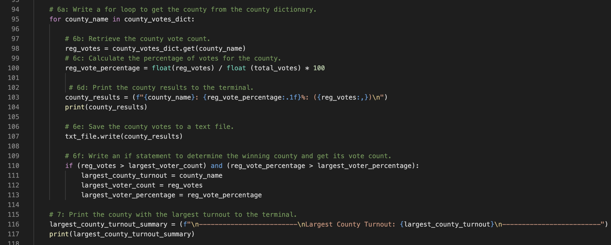
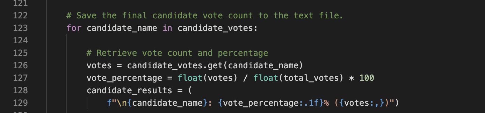
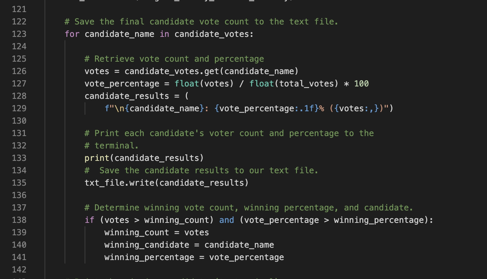
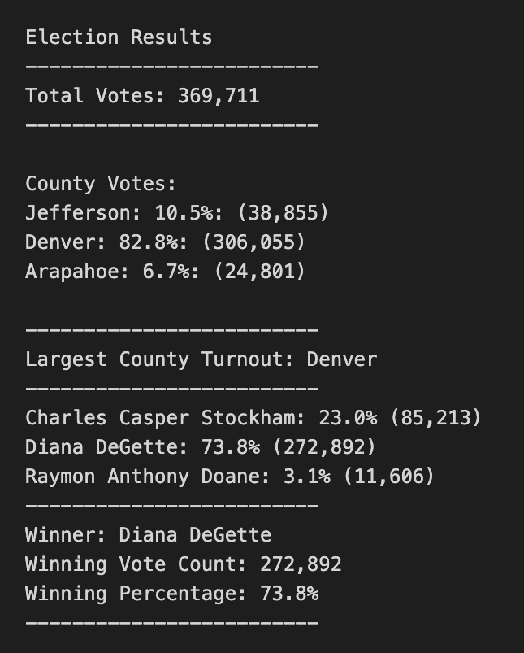

# Overview of the Election Audit
The purpose of this election audit is to find out three things: the voter turnout for each county, the percentage of votes from each county out of the total count and to find out which county had the highest voter turnout. With the experience we had doing or writing the code for this audit we were also given a chance to make some recommendations to the elections commission, based on how the code can be modified to suit their (possible) needs in the future.

# Election Audit Results

* There was a total of 369, 711 votes cast during the election.

* Three counties participated in this election: Arapahoe, Denver and Jefferson. Denver had the highest voter turnout, followed by Jefferson County at 38,855, which was 10.5% of the total voter turnout and Arapahoe County at 24,801 which was 6.7% of the total voter turnout.

  These were the lines of code used to determine the voter turnout for each county
  

* In terms of voter turnout, Denver had the most number of registered voters who participated in the elections. The 306,055 ballots cast from Denver made up 82.8% of the total votes for this election.
  The code used to determine the largest voter turnout by county is shown below.
  
 
* Three candidates were vying for the same position, Charles Casper Stockham, Diane DeGette and Raymon Anthony Doane.
Raymon Anthony Doane had the least number of votes at 11,606, which made up 3.1% of the voter share. Charles Casper Stockham had 85,213 votes which was equal to 23.0% of the voter share. Diane De Gette had the most number of votes at 272,892 and highest voter share at 73.8%.
  These were the lines of code used to determine the number of votes for each candidate. 
  

* Dianne DeGette is the winner of this election, having 272, 892 votes, which made up 73.8% of the total number of votes.
  The code used for determining who the winning candidate is is shown below.
  
  
  And finally, This is a summary of the election audit results.
  

# Election Audit Summary

For purposes of transparency, the script can also be modified to determine how many votes each candidate had in each county and not just the total in the three counties as shown in this analysis. A “for loop” with an “if statemement” for each county can be done to determine each candidates number of votes and percentages.

If data about which party the candidates belonged to was also given, we can also determine what party the county or counties — and collectively, the state is leaning towards. This can be done by modifying the “if statement” used when declaring the winner.

My last recommendation has nothing to do with the possible results of an election, but more to do with protecting the integrity of the results. Although in this audit, the source of the votes or the method by which the votes were cast — either by mail, or in-person voting— was not included in the data, I think it is something that the election commission, might want to look into and really study in case another unfortunate event, like a pandemic, happens so that the county or states's election comission/s can allocate the right resources, whether it be people or machinery OR the number of polling places or locations so that the election results can be given in a timely manner and avoid throwing suspicion for the cause of delay. If the data is provided, another “for loop” can be added for each county to determine the method by which the people voted. 
